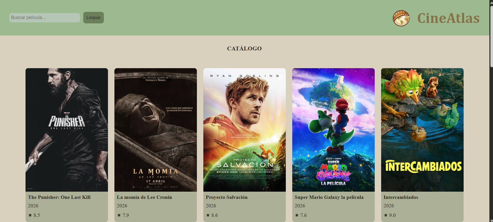
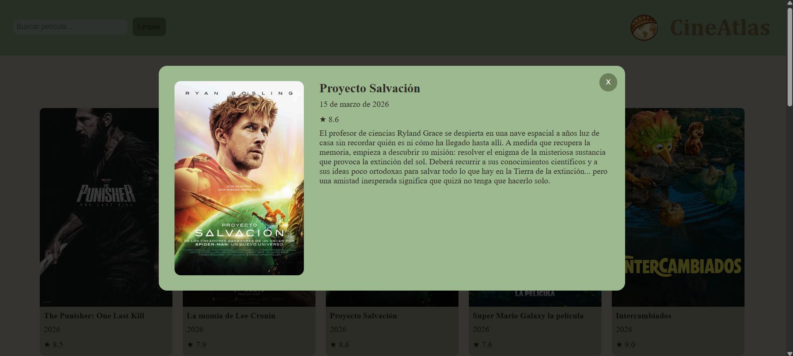
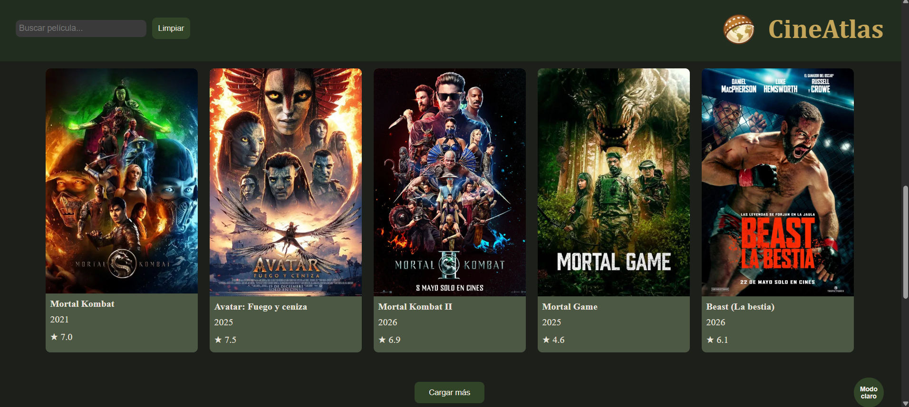
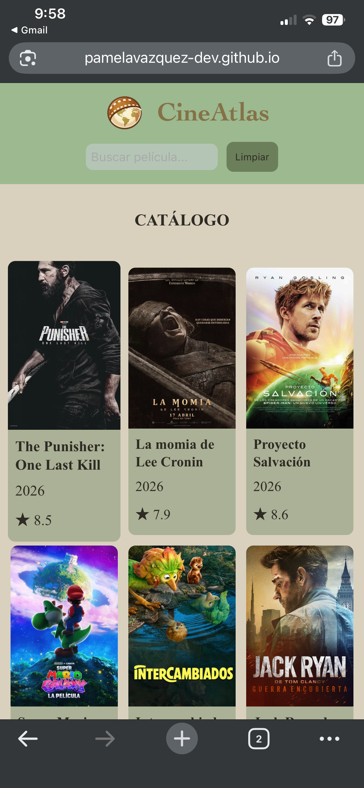

# 🎬 CineAtlas

Aplicación web interactiva para explorar películas populares usando la API de TheMovieDB. Permite buscar películas, ver su información detallada y explorar estadísticas de géneros mediante gráficas interactivas.

🔗 **[Ver aplicación en vivo](https://pamelavazquez-dev.github.io/CineAtlas/)**

---

## Capturas de pantalla

### Página principal


### Modal de película


### Modo oscuro


### Vista móvil


---

## Funcionalidades

- Catálogo de películas populares cargado desde la API de TheMovieDB
- Buscador con **debounce** para filtrar películas sin peticiones excesivas
- Modal con información detallada de cada película: título, fecha, puntuación y sinopsis
- Gráfica **doughnut** de géneros con Chart.js actualizada en tiempo real
- Historial de búsquedas visible al hacer clic en el buscador
- Paginación con botón "Cargar más"
- **Modo oscuro** persistido en `localStorage` 
- **Historial de búsquedas** de las últimas 10 consultas persistido en `localStorage`
- Diseño **responsive** para móvil, tablet y escritorio

---

## Tecnologías utilizadas

- JavaScript ES6+ (módulos, clases, `async/await`, `fetch`)
- [TheMovieDB API](https://www.themoviedb.org/)
- [Chart.js](https://www.chartjs.org/)
- HTML5 semántico
- CSS3 con variables, Flexbox y Grid
- `localStorage`

---

## Estructura del proyecto

```
CineAtlas/
├── index.html
├── styles/
│   └── style.css
├── js/
│   ├── main.js
│   ├── api.js
│   ├── config.js        
│   ├── Movie.js
│   ├── charts.js
│   ├── storage.js
│   └── modal.js
└── assets/
    └── img/
        ├── capturas/
        │   ├── inicio_catalogo.png
        │   ├── modal_pelicula.png
        │   ├── modo_oscuro.png
        │   └── movil.png
        ├── logo.webp
        └── no-poster.webp
---

## Autora

**Pamela Vázquez Rueda**  
Proyecto Integrador · JavaScript Avanzado · 2026
